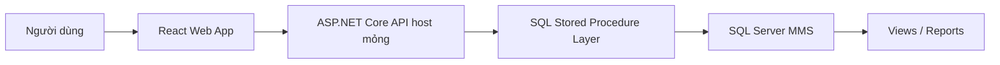

# Scope & Context

## Nguồn hệ thống hiện hữu

| Nguồn | Vai trò |
|---|---|
| `Quản lý kho vật tư .msapp` | App PC/desktop chính, 34 screen |
| `Kho vật tư .msapp` | App kho/mobile, 28 screen |
| `database-schema-toan-bo-ung-dung-quan-ly-kho-vat-tu.docx` | Tài liệu 56 entity SQL |

## Kiến trúc đích

