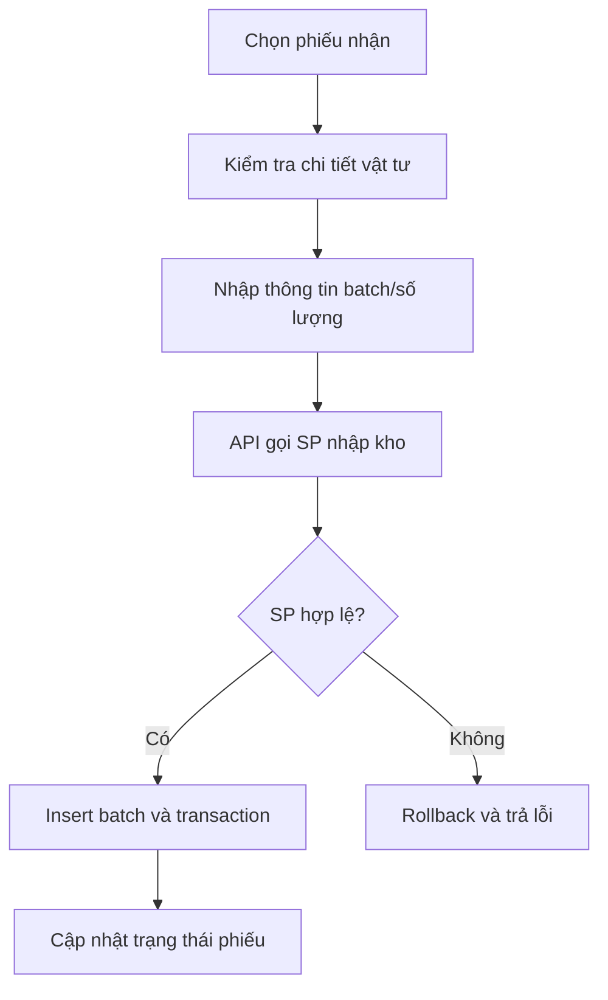
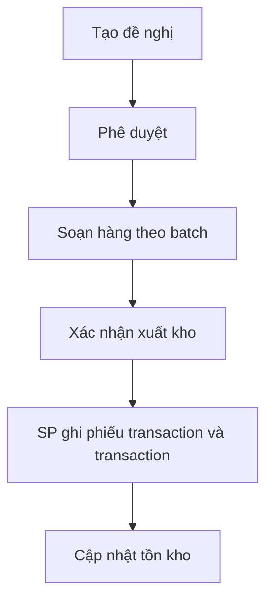

# Activity Diagrams

## Nhập kho

```mermaid
flowchart TD
  A["Chọn phiếu nhận"] --> B["Kiểm tra chi tiết vật tư"]
  B --> C["Nhập thông tin batch/số lượng"]
  C --> D["API gọi SP nhập kho"]
  D --> E{"SP hợp lệ?"}
  E -->|Có| F["Insert batch và transaction"]
  E -->|Không| G["Rollback và trả lỗi"]
  F --> H["Cập nhật trạng thái phiếu"]
```

## Xuất kho

```mermaid
flowchart TD
  A["Tạo đề nghị"] --> B["Phê duyệt"]
  B --> C["Soạn hàng theo batch"]
  C --> D["Xác nhận xuất kho"]
  D --> E["SP ghi phiếu transaction và transaction"]
  E --> F["Cập nhật tồn kho"]
```
