# BPMN Process

## Nguyên tắc BPMN khi chuyển React

- Lane React: nhập liệu, chọn danh mục, hiển thị trạng thái.
- Lane API: auth, permission, validate input, gọi SP.
- Lane SQL: xử lý rule nghiệp vụ và transaction.
- Lane User: xác nhận hành động và xử lý ngoại lệ.

## Ví dụ phiếu trả nội bộ

```mermaid
sequenceDiagram
  participant SX as Đơn vị sản xuất
  participant UI as React
  participant API as API
  participant SP as SQL SP
  participant WH as Thủ kho
  SX->>UI: Tạo phiếu trả
  UI->>API: Submit header/lines
  API->>SP: usp_tao_phieu_nhap_noibo
  API->>SP: usp_them_chitiet_nhap_noibo
  WH->>UI: Chọn phiếu chờ xử lý
  UI->>API: Xác nhận đạt/không đạt/từ chối
  API->>SP: usp_xacnhan_phieu_nhap_noibo
  SP-->>API: Commit/Rollback result
  API-->>UI: Cập nhật trạng thái
```

