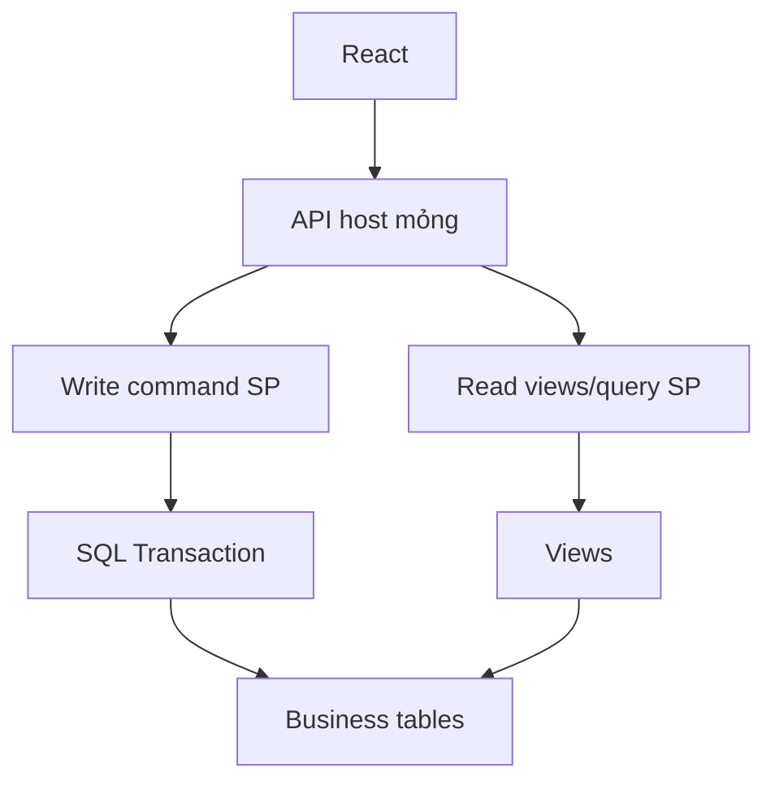

# Data Layer Architecture

## Quy tắc

- Ghi nghiệp vụ: stored procedure.
- Đọc báo cáo: view hoặc read-only stored procedure.
- Không nhận SQL động từ frontend.
- Không xử lý rule nghiệp vụ nhiều bảng trong backend.
