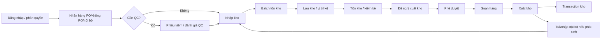

# Process Map Tổng Thể

```mermaid
flowchart LR
  Login["Đăng nhập / phân quyền"] --> Receive["Nhận hàng PO/không PO/nội bộ"]
  Receive --> QC{"Cần QC?"}
  QC -->|Có| QCDoc["Phiếu kiểm / đánh giá QC"]
  QC -->|Không| Putaway["Nhập kho"]
  QCDoc --> Putaway
  Putaway --> Batch["Batch tồn kho"]
  Batch --> Storage["Lưu kho / vị trí kệ"]
  Storage --> Inventory["Tồn kho / kiểm kê"]
  Inventory --> Request["Đề nghị xuất kho"]
  Request --> Approval["Phê duyệt"]
  Approval --> Picking["Soạn hàng"]
  Picking --> Issue["Xuất kho"]
  Issue --> Transaction["Transaction kho"]
  Issue --> Return["Trả/nhập nội bộ nếu phát sinh"]
  Return --> Putaway
```
