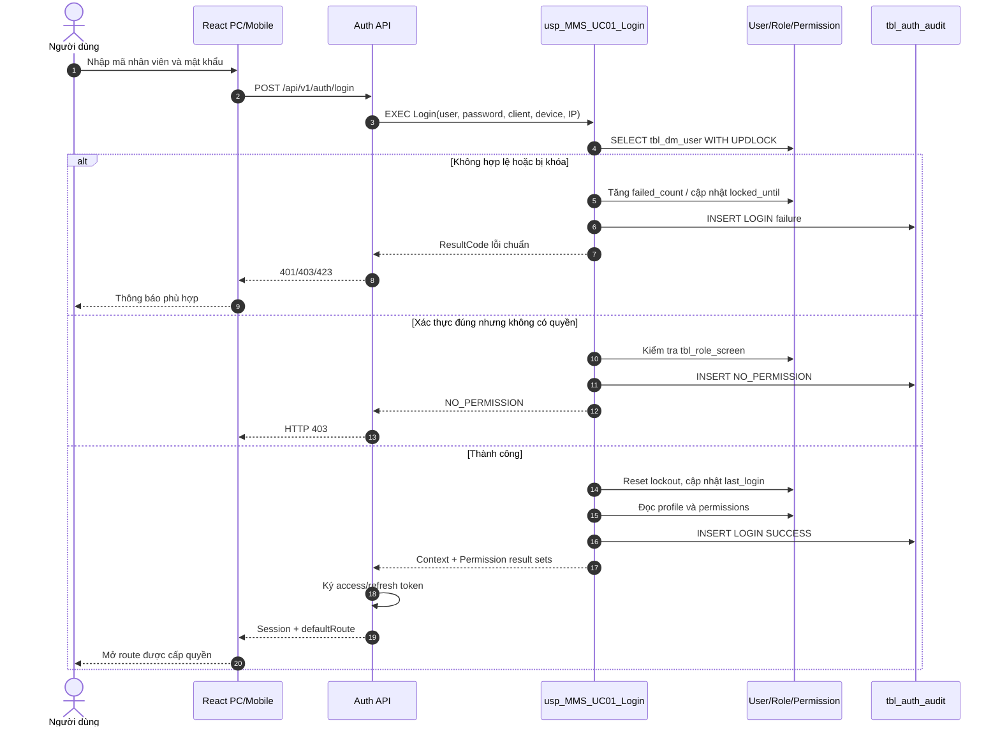
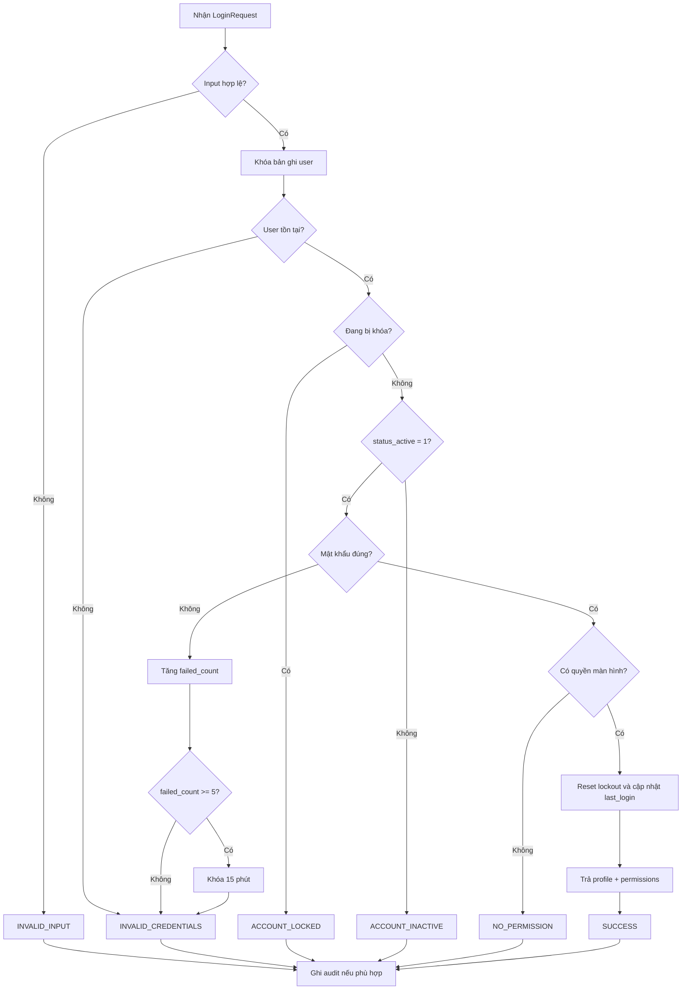
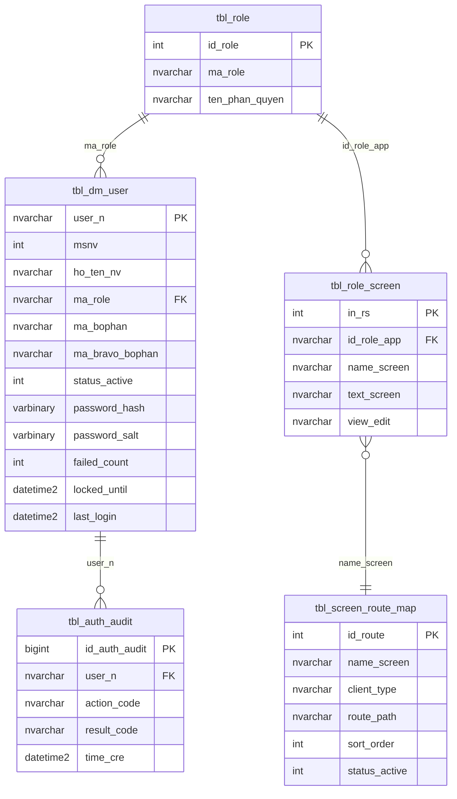

# Phân tích Thiết kế Logic UC01 - Đăng nhập và phân quyền PC/Mobile

Tài liệu mô tả chi tiết **Business Logic**, **UI/UX Guidelines**, **Programming Logic**, **Data Logic** và **Diagrams** cho chức năng đăng nhập của hệ thống Quản lý Kho Vật tư khi chuyển từ Power Apps sang React.

Phạm vi được đối chiếu trực tiếp từ các màn hình `scr_login` và `scr_mob_login` trong hai ứng dụng:

- `Quản lý kho vật tư .msapp`: đăng nhập PC, đăng nhập mobile, nạp quyền màn hình theo role và đổi mật khẩu.
- `Kho vật tư .msapp`: đăng nhập kho, gán nhóm vận hành cục bộ và đổi mật khẩu.

Nguyên tắc kiến trúc bắt buộc: React chỉ quản lý giao diện; backend xác thực request, gọi Stored Procedure, định dạng response và phát token; toàn bộ kiểm tra tài khoản, trạng thái tài khoản, phân quyền, khóa đăng nhập và đổi mật khẩu được xử lý trong SQL Stored Procedure.

---

## 1. Business Logic (Logic Nghiệp vụ)

### 1.1. Mục tiêu cốt lõi

- Xác thực người dùng bằng mã nhân viên/tài khoản và mật khẩu.
- Chỉ cho phép tài khoản đang hoạt động truy cập hệ thống.
- Nạp đúng thông tin nhân viên, bộ phận Bravo, vai trò và danh sách màn hình được phép sử dụng.
- Dùng chung một cơ chế đăng nhập cho PC và mobile; thiết bị chỉ ảnh hưởng màn hình đích, không thay đổi quy tắc xác thực.
- Không để React hoặc backend tự suy diễn quyền bằng danh sách mã nhân viên hard-code.
- Ghi nhận lịch sử đăng nhập thành công/thất bại phục vụ audit và điều tra sự cố.

### 1.2. Hiện trạng Power Apps đã đối chiếu

| Nguồn | Cách xác thực hiện tại | Phân quyền/điều hướng | Điểm cần xử lý khi chuyển đổi |
|---|---|---|---|
| `Quản lý kho vật tư` - PC | `LookUp(tbl_dm_user, user_n = Trim(user_input.Text))`, sau đó so sánh trực tiếp `var_user.password` | Lọc `tbl_role_screen` theo `id_role_app = var_user.ma_role`; vào `scr_main` | Mật khẩu đang được đọc và so sánh ở client; cần chuyển hoàn toàn về SP |
| `Quản lý kho vật tư` - Mobile | Tra `tbl_dm_user`, so sánh trực tiếp mật khẩu | Nạp quyền rồi vào `scr_mob_denghi_xuatkho_log` | Chưa chuẩn hóa `Trim`; màn hình đích đang cố định |
| `Kho vật tư` | Tra `tbl_dm_user`, so sánh `password` và `user_n` | Vào `scr_main`; gán `var_in` bằng danh sách MSNV hard-code | Chưa nạp `tbl_role_screen`; hard-code người dùng tạo rủi ro sai quyền |
| Cả hai app | `Patch(tbl_dm_user, ..., {password: ...})` | Đổi mật khẩu trực tiếp từ client | Mật khẩu dạng rõ; không có policy, khóa tài khoản hoặc audit đầy đủ |

### 1.3. Actor

- Nhân viên kho, QC, sản xuất, kế hoạch, quản lý hoặc quản trị hệ thống.
- React Web Client chạy trên PC hoặc thiết bị mobile/PDA.
- Backend API đóng vai trò Auth Gateway mỏng.
- SQL Server và các Stored Procedure UC01.

### 1.4. Tiền điều kiện

- Người dùng có bản ghi trong `dbo.tbl_dm_user`.
- `status_active = 1` đối với tài khoản được phép đăng nhập.
- `ma_role` của người dùng được khai báo trong `dbo.tbl_role`.
- Role có ít nhất một quyền hợp lệ trong `dbo.tbl_role_screen`.
- Client gửi request qua HTTPS.
- Các cột bảo mật bổ sung và SP UC01 đã được triển khai trước khi cắt chuyển khỏi Power Apps.

### 1.5. Hậu điều kiện

Khi thành công:

- API trả access token, thông tin người dùng và danh sách quyền màn hình.
- React chỉ tạo route/menu từ danh sách quyền do SP trả về.
- Thời điểm đăng nhập gần nhất và audit đăng nhập được cập nhật.
- Người dùng được điều hướng đến route mặc định hợp lệ đầu tiên cho loại thiết bị.

Khi thất bại:

- Không trả mật khẩu, hash, salt hoặc thông tin cho biết tài khoản có tồn tại hay không.
- Số lần sai được tăng và tài khoản có thể bị khóa tạm theo policy.
- Audit lưu mã kết quả, tài khoản nhập, IP, thiết bị và thời điểm.

### 1.6. Business Rules

- **`[BR-UC01-01]` Chuẩn hóa tài khoản:** `user_n` được `LTRIM/RTRIM`, không phân biệt chữ hoa/thường theo collation nghiệp vụ. Giá trị rỗng bị từ chối.
- **`[BR-UC01-02]` Không lộ thông tin tài khoản:** Sai tài khoản và sai mật khẩu cùng trả mã `INVALID_CREDENTIALS`.
- **`[BR-UC01-03]` Trạng thái hoạt động:** Chỉ `status_active = 1` được đăng nhập. Tài khoản ngừng hoạt động trả `ACCOUNT_INACTIVE` sau khi đã xác thực phù hợp ở tầng nội bộ; UI hiển thị thông báo chung.
- **`[BR-UC01-04]` Mật khẩu không xử lý ở client:** React không đọc trường `password`; backend không truy vấn bảng người dùng trực tiếp.
- **`[BR-UC01-05]` Mật khẩu mục tiêu phải được băm:** SQL lưu `password_hash` và `password_salt`; không lưu mật khẩu mới dạng rõ.
- **`[BR-UC01-06]` Khóa tạm:** Sau 5 lần sai liên tiếp trong cửa sổ policy, tài khoản bị khóa 15 phút. Số lần và thời gian khóa do SP quản lý.
- **`[BR-UC01-07]` Quyền theo role:** Quyền được lấy từ `tbl_role_screen.id_role_app = tbl_dm_user.ma_role`; chỉ các dòng quyền có tên màn hình hợp lệ mới trả về client.
- **`[BR-UC01-08]` Không hard-code MSNV:** Nhóm `bb`, `vt` hoặc quyền đặc thù phải được cấu hình trong role/bộ phận, không viết trong React.
- **`[BR-UC01-09]` Không có quyền:** Tài khoản xác thực đúng nhưng không có màn hình hợp lệ trả `NO_PERMISSION`; không tạo phiên đăng nhập sử dụng được.
- **`[BR-UC01-10]` Route mặc định:** PC ưu tiên `/home`; mobile ưu tiên route mobile được cấp quyền. Nếu route ưu tiên không có quyền, chọn quyền có thứ tự nhỏ nhất.
- **`[BR-UC01-11]` Đổi mật khẩu:** Bắt buộc đúng mật khẩu hiện tại; mật khẩu mới và xác nhận phải trùng; không trùng mật khẩu hiện tại; đáp ứng policy độ dài và độ phức tạp.
- **`[BR-UC01-12]` Phiên đăng nhập:** Access token có thời hạn ngắn; thông tin quyền trong token chỉ là snapshot. Các nghiệp vụ quan trọng vẫn kiểm tra quyền phía server/SP.
- **`[BR-UC01-13]` Audit:** Mỗi lần login và đổi mật khẩu phải ghi log thành công/thất bại, nhưng tuyệt đối không ghi mật khẩu.
- **`[BR-UC01-14]` Atomicity:** Cập nhật failed count, khóa tài khoản, last login và audit phải nằm trong transaction của SP.

### 1.7. Luồng chính - Đăng nhập

| Bước | Actor/Thành phần | Thao tác | Kết quả |
|---|---|---|---|
| 1 | Người dùng | Mở trang đăng nhập PC/mobile | React hiển thị form tương ứng thiết bị |
| 2 | Người dùng | Nhập mã nhân viên và mật khẩu | React chỉ kiểm tra bắt buộc nhập và độ dài tối đa |
| 3 | React | Gọi `POST /api/v1/auth/login` | Gửi `username`, `password`, `clientType`, `deviceId` |
| 4 | Backend | Bổ sung IP/User-Agent và gọi `dbo.usp_MMS_UC01_Login` | Không tự đọc bảng hoặc tự kiểm tra role |
| 5 | SQL SP | Khóa bản ghi user, kiểm tra trạng thái, khóa tạm và mật khẩu | Fail-fast theo mã kết quả chuẩn |
| 6 | SQL SP | Nạp profile, role và quyền màn hình | Trả hai result set: login context và permissions |
| 7 | Backend | Phát access token/refresh token khi `SUCCESS` | Token không chứa dữ liệu nhạy cảm |
| 8 | React | Lưu phiên theo cơ chế bảo mật, dựng menu/route | Điều hướng tới route mặc định được cấp quyền |

### 1.8. Luồng phụ - Đổi mật khẩu

| Bước | Actor/Thành phần | Thao tác | Kết quả |
|---|---|---|---|
| 1 | Người dùng | Mở hộp thoại Đổi mật khẩu | Hiển thị mật khẩu cũ, mới, xác nhận mới |
| 2 | React | Kiểm tra đủ trường và hai mật khẩu mới trùng nhau | Không tự xác thực mật khẩu cũ |
| 3 | Backend | Gọi `dbo.usp_MMS_UC01_ChangePassword` | Truyền user từ token, không tin user do client tự gửi |
| 4 | SQL SP | Xác thực mật khẩu hiện tại và policy | Rollback khi không hợp lệ |
| 5 | SQL SP | Tạo salt mới, cập nhật hash, reset failed count và ghi audit | Trả `SUCCESS` |
| 6 | Backend/React | Thu hồi refresh token cũ và yêu cầu đăng nhập lại | Giảm rủi ro chiếm dụng phiên |

### 1.9. Luồng ngoại lệ

| Mã | Tình huống | HTTP | Xử lý UI | Xử lý SQL |
|---|---|---:|---|---|
| `INVALID_INPUT` | Thiếu tài khoản/mật khẩu | 400 | Đánh dấu trường bắt buộc | Không truy cập bảng |
| `INVALID_CREDENTIALS` | Tài khoản hoặc mật khẩu sai | 401 | Thông báo chung | Tăng `failed_count`, ghi audit |
| `ACCOUNT_LOCKED` | Đang trong thời gian khóa | 423 | Hiển thị thời gian thử lại | Không kiểm tra tiếp mật khẩu |
| `ACCOUNT_INACTIVE` | `status_active <> 1` | 403 | Liên hệ quản trị | Ghi audit, không tạo phiên |
| `NO_PERMISSION` | Đúng mật khẩu nhưng role không có màn hình | 403 | Thông báo chưa được phân quyền | Không phát phiên hợp lệ |
| `PASSWORD_POLICY_FAILED` | Mật khẩu mới không đạt policy | 422 | Hiển thị yêu cầu policy | Không cập nhật user |
| `DATABASE_ERROR` | Lỗi SQL ngoài dự kiến | 500 | Thông báo thử lại | Rollback toàn bộ transaction |

---

## 2. UI/UX Guidelines

### 2.1. Cấu trúc màn hình PC

- Tiêu đề hệ thống và tên môi trường ở phần đầu trang.
- Form đăng nhập rộng tối đa 420 px, gồm Mã nhân viên, Mật khẩu, nút hiện/ẩn mật khẩu và nút Đăng nhập.
- Link Đổi mật khẩu chỉ mở dialog; không điều hướng sang trang khác.
- Nút Đăng nhập có loading state cố định kích thước để tránh xê dịch bố cục.
- Không hiển thị tùy chọn PC/Mobile bằng nút chuyển màn hình; responsive routing tự quyết định layout.

### 2.2. Cấu trúc màn hình Mobile/PDA

- Vùng chạm tối thiểu 44 x 44 px.
- Form một cột, không dùng bảng ngang.
- Bàn phím tự mở ở trường Mã nhân viên; hỗ trợ Enter chuyển sang mật khẩu và Enter lần hai để submit.
- Sau lỗi chỉ xóa mật khẩu, giữ mã nhân viên để thao tác nhanh.
- Route sau đăng nhập được lấy từ `defaultRoute` do API trả về, không cố định `scr_mob_denghi_xuatkho_log`.

### 2.3. Trạng thái giao diện

| Trạng thái | Hiển thị |
|---|---|
| Idle | Form sẵn sàng nhập, nút Đăng nhập bật khi đủ hai trường |
| Submitting | Khóa submit lặp, hiện spinner trong nút |
| Invalid | Thông báo chung “Thông tin đăng nhập không đúng” |
| Locked | Cảnh báo khóa tạm và thời gian có thể thử lại |
| No permission | Thông báo tài khoản chưa được phân quyền |
| Success | Chuyển route; không để form đăng nhập trong browser history nghiệp vụ |

### 2.4. Yêu cầu accessibility và bảo mật UI

- Label liên kết đúng với input; lỗi dùng `aria-describedby` và vùng thông báo `aria-live`.
- Cho phép trình quản lý mật khẩu hoạt động; không chặn paste mật khẩu.
- Không lưu mật khẩu vào `localStorage`, Redux store, log trình duyệt hoặc telemetry.
- Không phân biệt thông báo “không tồn tại user” với “sai password”.
- Nút hiện mật khẩu dùng icon quen thuộc và có tooltip/accessible label.

---

## 3. Programming Logic

### 3.1. Ranh giới trách nhiệm

| Lớp | Được phép | Không được phép |
|---|---|---|
| React | Thu thập input, validation hình thức, loading/error, dựng menu từ DTO | Query SQL, so sánh mật khẩu, tự gán role, hard-code MSNV |
| Backend API | Xác thực transport, rate limit, gọi SP, phát/thu hồi token, map HTTP | Viết lại business rule, đọc bảng user/role trực tiếp |
| SQL Stored Procedure | Xác thực credential, trạng thái, lockout, permission, audit, đổi password | Trả password/hash/salt ra ngoài |

### 3.2. React types và API contract

```typescript
export type ClientType = 'PC' | 'MOBILE';

export interface LoginRequest {
  username: string;
  password: string;
  clientType: ClientType;
  deviceId?: string;
}

export interface ScreenPermission {
  screenName: string;
  screenText: string;
  accessMode: 'VIEW' | 'EDIT';
  route: string;
  order: number;
}

export interface LoginUser {
  username: string;
  employeeId: number | null;
  fullName: string | null;
  roleCode: string;
  departmentCode: string | null;
  bravoDepartmentCode: string | null;
  bravoDepartmentName: string | null;
}

export interface LoginResponse {
  accessToken: string;
  refreshToken: string;
  expiresIn: number;
  defaultRoute: string;
  user: LoginUser;
  permissions: ScreenPermission[];
}
```

### 3.3. React submit flow

```typescript
async function submitLogin(values: LoginRequest): Promise<void> {
  const payload: LoginRequest = {
    username: values.username.trim(),
    password: values.password,
    clientType: isMobileDevice() ? 'MOBILE' : 'PC',
    deviceId: getDeviceId(),
  };

  setSubmitting(true);
  setError(null);

  try {
    const session = await authApi.login(payload);
    authStore.establishSession(session);
    router.replace(session.defaultRoute);
  } catch (error) {
    setError(mapAuthError(error));
    passwordInputRef.current?.focus();
  } finally {
    setSubmitting(false);
  }
}
```

React chỉ giữ `permissions` để điều khiển trải nghiệm hiển thị. Việc ẩn menu không thay thế kiểm tra quyền ở API/SP.

### 3.4. API endpoints

| Method | Endpoint | Stored Procedure | Mục đích |
|---|---|---|---|
| `POST` | `/api/v1/auth/login` | `dbo.usp_MMS_UC01_Login` | Xác thực và nạp quyền |
| `POST` | `/api/v1/auth/change-password` | `dbo.usp_MMS_UC01_ChangePassword` | Đổi mật khẩu |
| `POST` | `/api/v1/auth/refresh` | `dbo.usp_MMS_UC01_ValidateSession` | Kiểm tra phiên trước khi cấp token mới |
| `POST` | `/api/v1/auth/logout` | `dbo.usp_MMS_UC01_RevokeSession` | Thu hồi refresh token/phiên |
| `GET` | `/api/v1/auth/me` | `dbo.usp_MMS_UC01_GetContext` | Nạp lại profile và quyền hiện hành |

### 3.5. ASP.NET Core controller mỏng

```csharp
[ApiController]
[Route("api/v1/auth")]
public sealed class AuthController : ControllerBase
{
    private readonly IStoredProcedureExecutor _sp;
    private readonly ITokenService _tokens;

    public AuthController(IStoredProcedureExecutor sp, ITokenService tokens)
    {
        _sp = sp;
        _tokens = tokens;
    }

    [HttpPost("login")]
    [AllowAnonymous]
    public async Task<IActionResult> Login(LoginRequest request)
    {
        if (string.IsNullOrWhiteSpace(request.Username) ||
            string.IsNullOrEmpty(request.Password))
            return BadRequest(new { code = "INVALID_INPUT" });

        var result = await _sp.QueryMultipleAsync<LoginContextRow, PermissionRow>(
            "dbo.usp_MMS_UC01_Login",
            new {
                UserName = request.Username.Trim(),
                Password = request.Password,
                ClientType = request.ClientType,
                DeviceId = request.DeviceId,
                IpAddress = HttpContext.Connection.RemoteIpAddress?.ToString(),
                UserAgent = Request.Headers.UserAgent.ToString()
            });

        var context = result.Header;
        if (context.ResultCode != "SUCCESS")
            return StatusCode(AuthHttpStatus.From(context.ResultCode),
                new { code = context.ResultCode, message = context.Message });

        var token = _tokens.Issue(context.UserName, context.RoleCode);
        return Ok(AuthResponse.From(context, result.Rows, token));
    }
}
```

Backend không chứa nhánh kiểm tra tài khoản, trạng thái, mật khẩu hoặc quyền. `ITokenService` chỉ ký token từ kết quả đã được SP xác nhận.

---

## 4. SQL Stored Procedure Design

### 4.1. Thay đổi schema bảo mật đề xuất

Các cột dưới đây là phần mở rộng mục tiêu, cần migration có kiểm soát:

```sql
ALTER TABLE dbo.tbl_dm_user ADD
    password_hash VARBINARY(64) NULL,
    password_salt VARBINARY(32) NULL,
    failed_count INT NOT NULL CONSTRAINT DF_tbl_dm_user_failed_count DEFAULT (0),
    locked_until DATETIME2(0) NULL,
    last_login DATETIME2(0) NULL,
    time_up DATETIME2(0) NULL,
    user_up NVARCHAR(50) NULL,
    row_version ROWVERSION;
GO

CREATE TABLE dbo.tbl_auth_audit
(
    id_auth_audit BIGINT IDENTITY(1,1) NOT NULL PRIMARY KEY,
    user_n NVARCHAR(50) NULL,
    action_code NVARCHAR(30) NOT NULL,
    result_code NVARCHAR(50) NOT NULL,
    client_type NVARCHAR(10) NULL,
    device_id NVARCHAR(100) NULL,
    ip_address NVARCHAR(50) NULL,
    user_agent NVARCHAR(500) NULL,
    time_cre DATETIME2(0) NOT NULL
        CONSTRAINT DF_tbl_auth_audit_time_cre DEFAULT (SYSDATETIME())
);
GO
```

Trong giai đoạn chuyển đổi, cột `password` cũ chỉ được dùng một lần để migrate sang hash trong SP. Sau khi toàn bộ tài khoản đã migrate, khóa quyền đọc cột này và loại bỏ theo kế hoạch database migration.

### 4.2. Hợp đồng `dbo.usp_MMS_UC01_Login`

**Input**

| Tham số | Kiểu | Bắt buộc | Ý nghĩa |
|---|---|---:|---|
| `@UserName` | `nvarchar(50)` | Có | `tbl_dm_user.user_n` |
| `@Password` | `nvarchar(200)` | Có | Mật khẩu dạng rõ chỉ tồn tại trong request/SP memory |
| `@ClientType` | `nvarchar(10)` | Có | `PC` hoặc `MOBILE` |
| `@DeviceId` | `nvarchar(100)` | Không | Mã nhận diện thiết bị |
| `@IpAddress` | `nvarchar(50)` | Không | IP từ backend |
| `@UserAgent` | `nvarchar(500)` | Không | User-Agent từ backend |

**Result set 1 - Login Context**

`ResultCode`, `Message`, `UserName`, `EmployeeId`, `FullName`, `RoleCode`, `DepartmentCode`, `BravoDepartmentCode`, `BravoDepartmentName`, `DefaultRoute`, `RetryAfterSeconds`.

**Result set 2 - Permissions**

`ScreenName`, `ScreenText`, `AccessMode`, `Route`, `SortOrder`.

### 4.3. Khung xử lý SP đăng nhập

```sql
CREATE OR ALTER PROCEDURE dbo.usp_MMS_UC01_Login
    @UserName NVARCHAR(50),
    @Password NVARCHAR(200),
    @ClientType NVARCHAR(10),
    @DeviceId NVARCHAR(100) = NULL,
    @IpAddress NVARCHAR(50) = NULL,
    @UserAgent NVARCHAR(500) = NULL
AS
BEGIN
    SET NOCOUNT ON;
    SET XACT_ABORT ON;

    DECLARE
        @Now DATETIME2(0) = SYSDATETIME(),
        @NormalizedUser NVARCHAR(50) = LTRIM(RTRIM(@UserName)),
        @StatusActive INT,
        @StoredLegacyPassword NVARCHAR(50),
        @PasswordHash VARBINARY(64),
        @PasswordSalt VARBINARY(32),
        @CalculatedHash VARBINARY(64),
        @FailedCount INT,
        @LockedUntil DATETIME2(0),
        @RoleCode NVARCHAR(50),
        @IsValid BIT = 0,
        @ResultCode NVARCHAR(50) = N'INVALID_CREDENTIALS';

    IF NULLIF(@NormalizedUser, N'') IS NULL OR NULLIF(@Password, N'') IS NULL
    BEGIN
        SELECT N'INVALID_INPUT' AS ResultCode,
               N'Vui lòng nhập đầy đủ tài khoản và mật khẩu.' AS Message;
        RETURN;
    END;

    IF @ClientType NOT IN (N'PC', N'MOBILE')
    BEGIN
        SELECT N'INVALID_INPUT' AS ResultCode,
               N'Loại thiết bị không hợp lệ.' AS Message;
        RETURN;
    END;

    BEGIN TRY
        BEGIN TRANSACTION;

        SELECT
            @StatusActive = status_active,
            @StoredLegacyPassword = [password],
            @PasswordHash = password_hash,
            @PasswordSalt = password_salt,
            @FailedCount = failed_count,
            @LockedUntil = locked_until,
            @RoleCode = ma_role
        FROM dbo.tbl_dm_user WITH (UPDLOCK, HOLDLOCK)
        WHERE user_n = @NormalizedUser;

        IF @StatusActive IS NULL
            SET @ResultCode = N'INVALID_CREDENTIALS';
        ELSE IF @LockedUntil IS NOT NULL AND @LockedUntil > @Now
            SET @ResultCode = N'ACCOUNT_LOCKED';
        ELSE IF @StatusActive <> 1
            SET @ResultCode = N'ACCOUNT_INACTIVE';
        ELSE
        BEGIN
            IF @PasswordHash IS NOT NULL AND @PasswordSalt IS NOT NULL
            BEGIN
                SET @CalculatedHash = HASHBYTES(
                    'SHA2_512',
                    @PasswordSalt + CONVERT(VARBINARY(MAX), @Password)
                );
                SET @IsValid = IIF(@CalculatedHash = @PasswordHash, 1, 0);
            END
            ELSE IF @StoredLegacyPassword = @Password
            BEGIN
                -- Chuyển đổi một lần từ mật khẩu Power Apps cũ sang hash.
                SET @PasswordSalt = CRYPT_GEN_RANDOM(32);
                SET @PasswordHash = HASHBYTES(
                    'SHA2_512',
                    @PasswordSalt + CONVERT(VARBINARY(MAX), @Password)
                );
                SET @IsValid = 1;

                UPDATE dbo.tbl_dm_user
                SET password_hash = @PasswordHash,
                    password_salt = @PasswordSalt,
                    [password] = NULL,
                    time_up = @Now,
                    user_up = N'UC01_MIGRATION'
                WHERE user_n = @NormalizedUser;
            END;

            IF @IsValid = 1 AND NOT EXISTS
            (
                SELECT 1
                FROM dbo.tbl_role_screen
                WHERE id_role_app = @RoleCode
                  AND NULLIF(LTRIM(RTRIM(name_screen)), N'') IS NOT NULL
            )
                SET @ResultCode = N'NO_PERMISSION';
            ELSE IF @IsValid = 1
                SET @ResultCode = N'SUCCESS';
            ELSE
                SET @ResultCode = N'INVALID_CREDENTIALS';
        END;

        IF @ResultCode = N'SUCCESS'
        BEGIN
            UPDATE dbo.tbl_dm_user
            SET failed_count = 0,
                locked_until = NULL,
                last_login = @Now,
                time_up = @Now,
                user_up = @NormalizedUser
            WHERE user_n = @NormalizedUser;
        END
        ELSE IF @ResultCode = N'INVALID_CREDENTIALS' AND @StatusActive IS NOT NULL
        BEGIN
            SET @FailedCount = ISNULL(@FailedCount, 0) + 1;
            UPDATE dbo.tbl_dm_user
            SET failed_count = @FailedCount,
                locked_until = CASE WHEN @FailedCount >= 5
                                    THEN DATEADD(MINUTE, 15, @Now)
                                    ELSE NULL END,
                time_up = @Now,
                user_up = N'UC01_LOGIN'
            WHERE user_n = @NormalizedUser;
        END;

        INSERT dbo.tbl_auth_audit
            (user_n, action_code, result_code, client_type,
             device_id, ip_address, user_agent, time_cre)
        VALUES
            (@NormalizedUser, N'LOGIN', @ResultCode, @ClientType,
             @DeviceId, @IpAddress, @UserAgent, @Now);

        COMMIT TRANSACTION;

        SELECT
            @ResultCode AS ResultCode,
            CASE @ResultCode
                WHEN N'SUCCESS' THEN N'Đăng nhập thành công.'
                WHEN N'ACCOUNT_LOCKED' THEN N'Tài khoản đang bị khóa tạm thời.'
                WHEN N'ACCOUNT_INACTIVE' THEN N'Tài khoản không hoạt động.'
                WHEN N'NO_PERMISSION' THEN N'Tài khoản chưa được phân quyền.'
                ELSE N'Thông tin đăng nhập không đúng.'
            END AS Message,
            CASE WHEN @ResultCode = N'SUCCESS' THEN
                 (SELECT user_n FROM dbo.tbl_dm_user
                  WHERE user_n = @NormalizedUser) END AS UserName,
            CASE WHEN @ResultCode = N'SUCCESS' THEN
                 (SELECT msnv FROM dbo.tbl_dm_user
                  WHERE user_n = @NormalizedUser) END AS EmployeeId,
            CASE WHEN @ResultCode = N'SUCCESS' THEN
                 (SELECT ho_ten_nv FROM dbo.tbl_dm_user
                  WHERE user_n = @NormalizedUser) END AS FullName,
            CASE WHEN @ResultCode = N'SUCCESS' THEN @RoleCode END AS RoleCode,
            CASE WHEN @ResultCode = N'SUCCESS' THEN
                 (SELECT ma_bophan FROM dbo.tbl_dm_user
                  WHERE user_n = @NormalizedUser) END AS DepartmentCode,
            CASE WHEN @ResultCode = N'SUCCESS' THEN
                 (SELECT ma_bravo_bophan FROM dbo.tbl_dm_user
                  WHERE user_n = @NormalizedUser) END AS BravoDepartmentCode,
            CASE WHEN @ResultCode = N'SUCCESS' THEN
                 (SELECT ten_bravo_bophan FROM dbo.tbl_dm_user
                  WHERE user_n = @NormalizedUser) END AS BravoDepartmentName,
            CASE WHEN @ResultCode <> N'SUCCESS' THEN NULL
                 WHEN @ClientType = N'MOBILE' THEN N'/mobile/home'
                 ELSE N'/home' END AS DefaultRoute,
            CASE WHEN @ResultCode = N'ACCOUNT_LOCKED'
                 THEN DATEDIFF(SECOND, @Now, @LockedUntil) ELSE 0 END
                 AS RetryAfterSeconds;

        SELECT
            rs.name_screen AS ScreenName,
            rs.text_screen AS ScreenText,
            COALESCE(NULLIF(rs.view_edit, N''), N'VIEW') AS AccessMode,
            COALESCE(m.route_path,
                     N'/legacy/' + REPLACE(rs.name_screen, N'scr_', N'')) AS Route,
            COALESCE(m.sort_order, rs.in_rs) AS SortOrder
        FROM dbo.tbl_role_screen rs
        LEFT JOIN dbo.tbl_screen_route_map m
               ON m.name_screen = rs.name_screen
              AND m.client_type = @ClientType
              AND m.status_active = 1
        WHERE rs.id_role_app = @RoleCode
          AND @ResultCode = N'SUCCESS'
        ORDER BY COALESCE(m.sort_order, rs.in_rs), rs.name_screen;
    END TRY
    BEGIN CATCH
        IF XACT_STATE() <> 0 ROLLBACK TRANSACTION;
        THROW;
    END CATCH;
END;
GO
```

`dbo.tbl_screen_route_map` là bảng mapping mới giữa tên màn hình Power Apps và route React. Nếu chưa tạo bảng này, SP có thể trả `ScreenName`, còn backend dùng cấu hình route tĩnh trong giai đoạn đầu; cấu hình đó không được dùng để quyết định quyền.

### 4.4. Quy tắc SP đổi mật khẩu

`dbo.usp_MMS_UC01_ChangePassword` phải thực hiện trong một transaction:

1. Khóa bản ghi user bằng `UPDLOCK, HOLDLOCK`.
2. Kiểm tra `status_active`, trạng thái khóa và hash mật khẩu hiện tại.
3. Kiểm tra policy tối thiểu: 8 ký tự, có chữ hoa, chữ thường và số; giới hạn tối đa 200 ký tự.
4. Từ chối nếu mật khẩu mới giống mật khẩu cũ.
5. Sinh salt mới bằng `CRYPT_GEN_RANDOM(32)` và hash bằng `SHA2_512`.
6. Reset `failed_count`, `locked_until`; cập nhật `time_up`, `user_up`.
7. Ghi `tbl_auth_audit` với action `CHANGE_PASSWORD`; không ghi nội dung mật khẩu.
8. Commit và trả mã kết quả chuẩn; rollback bằng `THROW` khi có lỗi.

---

## 5. Data Logic

### 5.1. Ma trận CRUD

| Bảng | Create | Read | Update | Delete | Vai trò trong UC01 |
|---|:---:|:---:|:---:|:---:|---|
| `tbl_dm_user` | - | X | X | - | Profile, trạng thái, role, hash, lockout, last login |
| `tbl_role` | - | X | - | - | Xác nhận role và tên phân quyền |
| `tbl_role_screen` | - | X | - | - | Danh sách màn hình/quyền theo role |
| `tbl_auth_audit` | X | - | - | - | Audit login và đổi mật khẩu |
| `tbl_screen_route_map` | - | X | - | - | Mapping màn hình cũ sang route React PC/mobile |

### 5.2. Thuộc tính hiện hữu dùng trong UC01

| Entity | Thuộc tính | Kiểu theo metadata app | Ý nghĩa |
|---|---|---|---|
| `tbl_dm_user` | `user_n` | `nvarchar(50)`, PK | Tài khoản đăng nhập |
| `tbl_dm_user` | `msnv` | `int` | Mã số nhân viên |
| `tbl_dm_user` | `ho_ten_nv` | `nvarchar(50)` | Họ tên |
| `tbl_dm_user` | `password` | `nvarchar(50)` | Mật khẩu legacy, phải loại bỏ sau migration |
| `tbl_dm_user` | `ma_role` | `nvarchar(50)` | Role của người dùng |
| `tbl_dm_user` | `chuc_danh` | `nvarchar(50)` | Chức danh |
| `tbl_dm_user` | `ma_bophan` | `nvarchar(50)` | Bộ phận nội bộ |
| `tbl_dm_user` | `ma_bravo_bophan` | `nvarchar(50)` | Mã đơn vị Bravo |
| `tbl_dm_user` | `ten_bravo_bophan` | `nvarchar(50)` | Tên đơn vị Bravo |
| `tbl_dm_user` | `status_active` | `int` | Trạng thái hoạt động |
| `tbl_role` | `ma_role` | `nvarchar(50)` | Mã role |
| `tbl_role` | `ten_phan_quyen` | `nvarchar(50)` | Tên role |
| `tbl_role_screen` | `id_role_app` | `nvarchar(50)` | Mã role được cấp quyền |
| `tbl_role_screen` | `name_screen` | `nvarchar(50)` | Tên màn hình Power Apps |
| `tbl_role_screen` | `text_screen` | `nvarchar(50)` | Nhãn hiển thị |
| `tbl_role_screen` | `view_edit` | `nvarchar(10)` | Mức quyền xem/sửa |
| `tbl_role_screen` | `in_rs` | `int`, PK kỹ thuật | ID/thứ tự dòng quyền |

### 5.3. Mô hình trạng thái tài khoản

| Trạng thái khái niệm | Điều kiện | Hành động cho phép |
|---|---|---|
| `ACTIVE` | `status_active = 1`, không bị khóa | Đăng nhập, đổi mật khẩu |
| `LOCKED_TEMPORARY` | `locked_until > SYSDATETIME()` | Chờ hết khóa hoặc admin mở khóa |
| `INACTIVE` | `status_active <> 1` | Không đăng nhập |
| `NO_PERMISSION` | Xác thực đúng nhưng không có `tbl_role_screen` | Không tạo phiên nghiệp vụ |

### 5.4. Mapping hiện trạng sang thiết kế React

| Power Apps | React/API/SQL đích |
|---|---|
| `var_user` | `LoginUser` trong auth context, không chứa password |
| `col_user_screens` | `permissions[]` do SP trả về |
| `user_screens_sys` | `tbl_screen_route_map` hoặc cấu hình route kỹ thuật |
| `Navigate(scr_main)` | `router.replace(defaultRoute)` |
| `Navigate(scr_mob_denghi_xuatkho_log)` | Route mobile mặc định theo quyền |
| `var_in` hard-code MSNV | Thuộc tính role/bộ phận được quản trị trong DB |
| `Patch(tbl_dm_user, password)` | `usp_MMS_UC01_ChangePassword` |

---

## 6. Diagrams

### 6.1. Sequence Diagram - Đăng nhập



### 6.2. Flowchart - Fail-fast authentication



### 6.3. Entity Relationship



---

## 7. Acceptance Criteria và Test Scenarios

| ID | Kịch bản | Kết quả mong đợi |
|---|---|---|
| `AC-UC01-01` | User active, đúng mật khẩu, có quyền PC | HTTP 200; có token, profile, permissions và route PC |
| `AC-UC01-02` | User active, đúng mật khẩu, có quyền mobile | HTTP 200; route mobile hợp lệ, không route cố định hard-code |
| `AC-UC01-03` | Sai user | HTTP 401 `INVALID_CREDENTIALS`; không lộ user tồn tại hay không |
| `AC-UC01-04` | Sai password | HTTP 401; tăng failed count và ghi audit |
| `AC-UC01-05` | Sai lần thứ 5 | Tài khoản bị khóa 15 phút |
| `AC-UC01-06` | Đăng nhập khi đang khóa | HTTP 423; không reset failed count |
| `AC-UC01-07` | `status_active = 0` | HTTP 403; không tạo token |
| `AC-UC01-08` | Đúng mật khẩu nhưng không có quyền | HTTP 403 `NO_PERMISSION` |
| `AC-UC01-09` | User legacy đăng nhập đúng lần đầu | Migrate sang hash; cột password legacy được xóa giá trị |
| `AC-UC01-10` | Hai request sai đồng thời | `UPDLOCK/HOLDLOCK` bảo đảm failed count chính xác |
| `AC-UC01-11` | Đổi password với mật khẩu cũ sai | Không cập nhật hash; có audit thất bại |
| `AC-UC01-12` | Password mới không đạt policy | Trả `PASSWORD_POLICY_FAILED` |
| `AC-UC01-13` | Đổi password thành công | Salt/hash mới, reset lockout, thu hồi phiên cũ |
| `AC-UC01-14` | Truy cập route không có quyền | API từ chối dù menu đã bị ẩn ở React |
| `AC-UC01-15` | SQL lỗi giữa transaction | Rollback cập nhật user và audit chưa hoàn tất |

### 7.1. Tiêu chí phi chức năng

- P95 của API login dưới 1 giây trong mạng nội bộ, không tính độ trễ SSO bên ngoài nếu có.
- Không xuất hiện mật khẩu/hash/salt trong response, log ứng dụng, telemetry hoặc exception.
- SP login chịu được request đồng thời và không làm mất số lần đăng nhập sai.
- API có rate limit theo IP và username; giá trị policy cấu hình ngoài React.
- Tất cả API sau login phải yêu cầu token hợp lệ và kiểm tra permission tương ứng.

---

## 8. Traceability

| Requirement/Rule | Power Apps nguồn | Dữ liệu | Thành phần đích |
|---|---|---|---|
| Xác thực user | `scr_login`, `scr_mob_login` | `tbl_dm_user` | `usp_MMS_UC01_Login` |
| Nạp quyền màn hình | `ClearCollect(col_user_screens, Filter(tbl_role_screen...))` | `tbl_role_screen`, `tbl_role` | Result set Permissions |
| Route PC/mobile | `Navigate(scr_main)`, `Navigate(scr_mob_denghi_xuatkho_log)` | `tbl_screen_route_map` | `defaultRoute` |
| Đổi mật khẩu | `Patch(tbl_dm_user, {password: ...})` | `tbl_dm_user`, `tbl_auth_audit` | `usp_MMS_UC01_ChangePassword` |
| Loại bỏ `var_in` hard-code | Danh sách MSNV trong `OnSelect` | Role/bộ phận cấu hình DB | Authorization context |
| Audit và lockout | Chưa có đầy đủ trong app cũ | `tbl_auth_audit`, cột security user | SP transaction |

## 9. Quyết định triển khai

- Tên SP chuẩn: `dbo.usp_MMS_UC01_Login`, `dbo.usp_MMS_UC01_ChangePassword`, `dbo.usp_MMS_UC01_GetContext`, `dbo.usp_MMS_UC01_ValidateSession`, `dbo.usp_MMS_UC01_RevokeSession`.
- Không sử dụng lại tên đề xuất tự động `usp_ng_nh_p_pc_mobile`.
- Giai đoạn đầu hỗ trợ migration mật khẩu legacy khi đăng nhập thành công; phải có báo cáo số tài khoản chưa migrate.
- Sau thời hạn chuyển đổi, xóa đường so sánh cột `password` legacy khỏi SP.
- Mọi endpoint nghiệp vụ khác nhận user từ token và truyền xuống SP; không nhận `user_cre` tùy ý từ body request.
