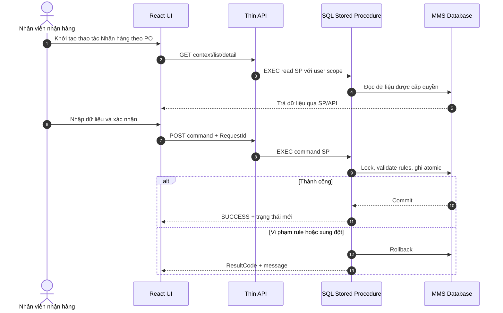
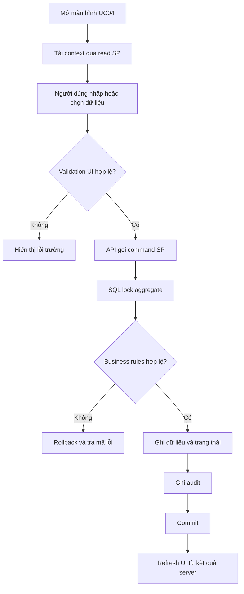
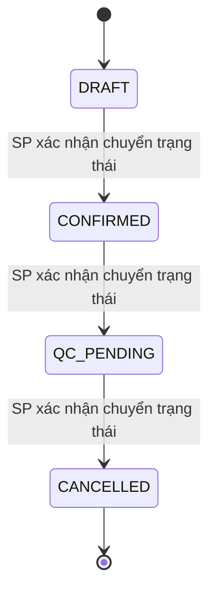

# Phân tích Thiết kế Logic UC04 - Nhận hàng theo PO

Tài liệu phân tích toàn diện **Business Logic**, **UI/UX Guidelines**, **Programming Logic**, **Data Logic** và **Diagrams** cho chức năng **Nhận hàng theo PO** khi chuyển hệ thống Quản lý Kho Vật tư từ Power Apps sang React.

Nguyên tắc bắt buộc: React chỉ xử lý giao diện; backend là API host mỏng; mọi quy tắc nghiệp vụ, chuyển trạng thái và transaction nhiều bảng được thực thi trong SQL Stored Procedure.

---

## 1. Business Logic (Logic Nghiệp vụ)

### 1.1. Mục tiêu cốt lõi

Tạo và chỉnh sửa phiếu nhận hàng có đối chiếu đơn đặt hàng và số lượng PO còn lại.

### 1.2. Phạm vi và nguồn hiện hữu

| Màn hình | Nguồn | Datasource phát hiện trong YAML |
|---|---|---|
| scr_nhanhang_po | Kho vật tư .msapp | vw_distinctPO |
| scr_nhanhang_po_chitiet | Kho vật tư .msapp | MMS_insert_phieu_nhanhang, vw_chitiet_ddh_conlai, tbl_ChiTietDDH |
| scr_nhanhang_po_nhapmoi | Kho vật tư .msapp | tbl_phieu_nhan_hang_image, vw_chitiet_ddh_conlai, tbl_chitiet_nhanhang, MMS_insert_nhanhang, tbl_phieu_nhan_hang, AzureBlobStorage, vw_nhanhang_copo, MMS_sql |
| scr_nhanhang_po_edit | Kho vật tư .msapp | tbl_phieu_nhan_hang_image, vw_chitiet_ddh_conlai, tbl_chitiet_nhanhang, tbl_phieu_nhan_hang, AzureBlobStorage, tbl_dm_vattu, MMS_sql |

- Thao tác Power Fx phát hiện: **Collect, Flow.Run, Navigate, Patch, Remove**.
- Datasource tham chiếu thực tế: `AzureBlobStorage, MMS_insert_nhanhang, MMS_insert_phieu_nhanhang, MMS_sql, tbl_ChiTietDDH, tbl_chitiet_nhanhang, tbl_dm_vattu, tbl_phieu_nhan_hang, tbl_phieu_nhan_hang_image, vw_chitiet_ddh_conlai, vw_distinctPO, vw_nhanhang_copo`.
- Nhãn giao diện tiêu biểu: `Ngày Giao`, `Ngày Đặt`, `Nhà Cung Cấp`, `Mã PO`, `Mã PO:`, `Nhà Cung Cấp:`, `Tìm Nhà Cung Cấp`, `Tìm PO`, `SL Đã Nhận`, `SL Đặt`, `TẠO PHIẾU`, `ĐVT`.

### 1.3. Actor

- Actor nghiệp vụ: Nhân viên nhận hàng.
- React Web Client trên PC hoặc mobile/PDA tùy màn hình.
- Backend API xác thực, phân quyền, validate hình thức và gọi SP.
- SQL Server MMS chịu trách nhiệm toàn bộ logic nghiệp vụ.

### 1.4. Tiền điều kiện

- Người dùng đã đăng nhập và có quyền `UC04`.
- Danh mục và chứng từ nguồn liên quan đang hoạt động.
- Dữ liệu đầu vào thuộc đúng kho/bộ phận mà người dùng được phép thao tác.
- Các Stored Procedure của use case đã được triển khai và version tương thích API.

### 1.5. Hậu điều kiện

- Khi thành công, dữ liệu và trạng thái được cập nhật atomic, có người thao tác và thời gian.
- API trả mã kết quả, thông báo và dữ liệu mới nhất do SP xác nhận.
- Khi thất bại, SP rollback toàn bộ phần ghi và không để dữ liệu trung gian dở dang.
- React refresh dữ liệu từ response/read SP; không tự giả lập trạng thái thành công.

### 1.6. Business Rules

- **`[BR-UC04-01]`** PO và dòng PO phải tồn tại.
- **`[BR-UC04-02]`** Một dòng nhận phải liên kết đúng vật tư của PO.
- **`[BR-UC04-03]`** Tổng đã nhận cộng lần này không vượt PO.
- **`[BR-UC04-04]`** Không sửa phiếu đã nhập kho.
- **`[BR-UC04-05]`** Số lượng nhận dùng decimal và đúng đơn vị.
- **`[BR-UC04-06]`** SP khóa dòng PO khi kiểm tra số lượng còn lại.

- **`[BR-UC04-07]`** User thao tác lấy từ token; SP kiểm tra lại quyền và phạm vi dữ liệu.
- **`[BR-UC04-08]`** Mọi command phải hỗ trợ `RequestId` để chống gửi lặp.
- **`[BR-UC04-09]`** Không dùng SQL động do client truyền và không cho backend cập nhật bảng trực tiếp.

### 1.7. Luồng chính

| Bước | Thao tác | React/API | SQL Stored Procedure |
|---|---|---|---|
| 1 | Tìm và chọn PO | Hiển thị/thu thập dữ liệu và gọi API | Đọc, kiểm tra rule hoặc ghi dữ liệu trong SP |
| 2 | Nạp chi tiết PO còn lại | Hiển thị/thu thập dữ liệu và gọi API | Đọc, kiểm tra rule hoặc ghi dữ liệu trong SP |
| 3 | Nhập số chứng từ và thông tin giao hàng | Hiển thị/thu thập dữ liệu và gọi API | Đọc, kiểm tra rule hoặc ghi dữ liệu trong SP |
| 4 | Nhập số lượng nhận theo từng dòng | Hiển thị/thu thập dữ liệu và gọi API | Đọc, kiểm tra rule hoặc ghi dữ liệu trong SP |
| 5 | Kiểm tra tổng nhận với PO | Hiển thị/thu thập dữ liệu và gọi API | Đọc, kiểm tra rule hoặc ghi dữ liệu trong SP |
| 6 | Xác nhận phiếu nhận | Hiển thị/thu thập dữ liệu và gọi API | Đọc, kiểm tra rule hoặc ghi dữ liệu trong SP |
| 7 | Chuyển bước QC hoặc nhập kho | Hiển thị/thu thập dữ liệu và gọi API | Đọc, kiểm tra rule hoặc ghi dữ liệu trong SP |

### 1.8. Luồng ngoại lệ

| Mã | Tình huống | HTTP | Xử lý bắt buộc |
|---|---|---:|---|
| `INVALID_INPUT` | Thiếu hoặc sai định dạng dữ liệu | 400 | React đánh dấu trường; SP không ghi dữ liệu |
| `FORBIDDEN` | Không có quyền hoặc sai phạm vi kho | 403 | Không trả dữ liệu ngoài phạm vi |
| `NOT_FOUND` | Chứng từ/danh mục không tồn tại | 404 | Refresh danh sách và yêu cầu chọn lại |
| `INVALID_STATE` | Trạng thái hiện tại không cho phép thao tác | 409 | SP rollback, trả trạng thái mới nhất |
| `CONCURRENCY_CONFLICT` | Dữ liệu đã thay đổi bởi phiên khác | 409 | UI tải lại dữ liệu; không tự retry command |
| `DUPLICATE_REQUEST` | `RequestId` đã xử lý | 200/409 | Trả lại kết quả cũ hoặc mã trùng an toàn |
| `DATABASE_ERROR` | Lỗi SQL ngoài dự kiến | 500 | Rollback và ghi technical log |

### 1.9. State Model

| Trạng thái | Ý nghĩa | Hành động tiếp theo |
|---|---|---|
| DRAFT | Trạng thái nghiệp vụ DRAFT của nhận hàng theo po | Theo state machine và quyền của SP |
| CONFIRMED | Trạng thái nghiệp vụ CONFIRMED của nhận hàng theo po | Theo state machine và quyền của SP |
| QC_PENDING | Trạng thái nghiệp vụ QC_PENDING của nhận hàng theo po | Theo state machine và quyền của SP |
| CANCELLED | Trạng thái nghiệp vụ CANCELLED của nhận hàng theo po | Theo state machine và quyền của SP |

---

## 2. UI/UX Guidelines

### 2.1. Cấu trúc màn hình

- Thanh tiêu đề hiển thị tên nghiệp vụ, kho/bộ phận và người đang thao tác.
- Vùng bộ lọc/danh mục ở đầu, vùng dữ liệu chính ở giữa và thanh hành động cố định ở cuối.
- Danh sách nhiều dòng dùng table trên PC và list compact trên mobile, không lồng card.
- Trạng thái hiển thị bằng badge có cả màu và chữ; không chỉ dựa vào màu.
- Command chính chỉ bật khi dữ liệu đầu vào và trạng thái UI hợp lệ.

### 2.2. Trạng thái tương tác

| UI State | Hành vi |
|---|---|
| `idle` | Sẵn sàng nhập/chọn dữ liệu |
| `loading` | Skeleton cho vùng danh sách; giữ ổn định kích thước layout |
| `editing` | Cho phép thay đổi trường theo quyền và trạng thái |
| `submitting` | Khóa submit lặp; hiển thị tiến trình trong nút |
| `success` | Hiển thị mã chứng từ/kết quả và refresh từ server |
| `error` | Giữ dữ liệu người dùng, chỉ rõ trường hoặc rule bị lỗi |
| `conflict` | Cảnh báo dữ liệu đã đổi và cung cấp nút tải lại |

### 2.3. Responsive và accessibility

- Vùng chạm mobile tối thiểu 44 x 44 px; input số mở bàn phím số.
- Table rộng chuyển sang chế độ row detail trên màn hình nhỏ.
- Label liên kết input; lỗi dùng `aria-describedby`; dialog giữ focus đúng chuẩn.
- Hỗ trợ bàn phím cho tìm kiếm, thêm dòng, xác nhận và đóng dialog.
- Không hiển thị hướng dẫn kỹ thuật hoặc tên bảng/SP trong UI sản xuất.

---

## 3. Programming Logic

### 3.1. Ranh giới trách nhiệm

| Lớp | Trách nhiệm | Không được thực hiện |
|---|---|---|
| React | State giao diện, validation định dạng, gọi API, render kết quả | Tính rule nghiệp vụ, đổi trạng thái, ghi SQL |
| Backend | Auth, permission, request schema, correlation id, gọi SP, map HTTP | Viết lại rule hoặc transaction nhiều bảng |
| SQL SP | Validation nghiệp vụ, locking, state transition, CRUD atomic, audit | Trả dữ liệu ngoài phạm vi quyền |

### 3.2. React contract đề xuất

```typescript
export interface Nh_n_h_ng_theo_POCommand {
  requestId: string;
  action: string;
  documentId?: number | string;
  warehouseCode?: string;
  payload: Record<string, unknown>;
}

export interface Nh_n_h_ng_theo_POResult {
  resultCode: string;
  message: string;
  documentId?: number | string;
  status: string;
  rowVersion?: string;
  data?: Record<string, unknown>;
}
```

Frontend phải gửi đúng kiểu dữ liệu API; số lượng dùng decimal-compatible string khi cần tránh sai số JavaScript.

### 3.3. API endpoints

| Method | Endpoint | Mục đích |
|---|---|---|
| `GET` | `/api/v1/receiving/uc04` | Danh sách có filter và phân trang |
| `GET` | `/api/v1/receiving/uc04/{id}` | Chi tiết chứng từ/đối tượng |
| `POST` | `/api/v1/receiving/uc04/commands` | Thực thi command qua SP |

### 3.4. Backend handler mỏng

```csharp
[HttpPost("commands")]
public async Task<IActionResult> Execute([FromBody] Nh_n_h_ng_theo_POCommand request)
{
    if (request.RequestId == Guid.Empty || string.IsNullOrWhiteSpace(request.Action))
        return BadRequest(ApiError.InvalidInput());

    var result = await _sp.ExecuteAsync<dynamic>(
        "usp_MMS_UC04_UpdatePOReceipt",
        new {
            RequestId = request.RequestId,
            Action = request.Action,
            DocumentId = request.DocumentId,
            PayloadJson = JsonSerializer.Serialize(request.Payload),
            UserName = _currentUser.UserName,
            CorrelationId = HttpContext.TraceIdentifier
        });

    return StoredProcedureResultMapper.ToActionResult(result);
}
```

Handler không được `INSERT/UPDATE` trực tiếp và không quyết định trạng thái tiếp theo.

---

## 4. SQL Stored Procedure Design

### 4.1. Danh mục SP

| Stored Procedure | Vai trò | Transaction |
|---|---|---|
| usp_MMS_UC04_GetOpenPO | Read/query | Read-only |
| usp_MMS_UC04_CreatePOReceipt | Command nghiệp vụ | Bắt buộc khi ghi |
| usp_MMS_UC04_UpdatePOReceipt | Command nghiệp vụ | Bắt buộc khi ghi |

### 4.2. Command SP contract

**Input chuẩn:** `@RequestId uniqueidentifier`, khóa chứng từ/đối tượng, action, dữ liệu nghiệp vụ, `@UserName`, `@CorrelationId` và `@ExpectedRowVersion` khi cập nhật.

**Output chuẩn:** `ResultCode`, `Message`, `DocumentId`, `Status`, `RowVersion` và result set chi tiết nếu cần.

### 4.3. Transaction skeleton

```sql
CREATE OR ALTER PROCEDURE dbo.usp_MMS_UC04_UpdatePOReceipt
    @RequestId UNIQUEIDENTIFIER,
    @Action NVARCHAR(30),
    @DocumentId BIGINT = NULL,
    @PayloadJson NVARCHAR(MAX) = NULL,
    @UserName NVARCHAR(50),
    @CorrelationId NVARCHAR(100) = NULL
AS
BEGIN
    SET NOCOUNT ON;
    SET XACT_ABORT ON;

    BEGIN TRY
        BEGIN TRANSACTION;

        -- 1. Chống request lặp bằng @RequestId.
        -- 2. Kiểm tra user, quyền, kho/bộ phận và dữ liệu đầu vào.
        -- 3. SELECT đối tượng gốc WITH (UPDLOCK, HOLDLOCK).
        -- 4. Kiểm tra state transition và các BR của UC04.
        -- 5. Ghi/cập nhật tbl_phieu_nhan_hang, tbl_chitiet_nhanhang, tbl_ChiTietDDH, vw_distinctPO theo nghiệp vụ.
        -- 6. Ghi audit và trạng thái cuối cùng.

        COMMIT TRANSACTION;
        SELECT N'SUCCESS' ResultCode,
               N'Xử lý thành công.' Message,
               @DocumentId DocumentId;
    END TRY
    BEGIN CATCH
        IF XACT_STATE() <> 0 ROLLBACK TRANSACTION;
        THROW;
    END CATCH;
END;
GO
```

Skeleton thể hiện ranh giới kiến trúc, không thay thế đặc tả cột chi tiết của từng SP khi triển khai.

### 4.4. Concurrency và idempotency

- Khóa bản ghi aggregate bằng `UPDLOCK, HOLDLOCK` trước khi kiểm tra số lượng/trạng thái.
- Dùng `rowversion` hoặc trạng thái kỳ vọng để phát hiện lost update.
- Mỗi command có `RequestId` duy nhất và bảng request audit để trả kết quả nhất quán khi retry.
- Không dùng `NOLOCK` trong bước quyết định số lượng tồn, định mức, trạng thái hoặc quyền ghi.

---

## 5. Data Logic

### 5.1. Ma trận CRUD

| Đối tượng | C | R | U | D | Vai trò |
|---|---|---|---|---|---|
| tbl_phieu_nhan_hang | X | X | X | - | Nguồn dữ liệu/chứng từ của use case |
| tbl_chitiet_nhanhang | X | X | X | - | Nguồn dữ liệu/chứng từ của use case |
| tbl_ChiTietDDH | X | X | X | - | Nguồn dữ liệu/chứng từ của use case |
| vw_distinctPO | - | X | - | - | Nguồn dữ liệu/chứng từ của use case |
| vw_chitiet_ddh_conlai | - | X | - | - | Nguồn dữ liệu/chứng từ của use case |
| vw_nhanhang_copo | - | X | - | - | Nguồn dữ liệu/chứng từ của use case |

### 5.2. Quan hệ dữ liệu trọng tâm

- Aggregate gốc: `tbl_phieu_nhan_hang`.
- Dữ liệu liên quan: `tbl_chitiet_nhanhang, tbl_ChiTietDDH, vw_distinctPO, vw_chitiet_ddh_conlai, vw_nhanhang_copo`.
- View chỉ dùng để đọc; command SP ghi vào bảng nguồn tương ứng.
- Khóa ngoại và khóa nghiệp vụ phải được xác nhận từ DDL SQL Server trước migration production.

### 5.3. Audit fields chuẩn

Mọi bảng command nên có hoặc liên kết được tới `user_cre`, `time_cre`, `user_up`, `time_up`, trạng thái và correlation/request id. Không thực hiện hard delete chứng từ đã phát sinh giao dịch.

---

## 6. Diagrams

### 6.1. Sequence Diagram



### 6.2. Activity Flow



### 6.3. State Diagram



---

## 7. Acceptance Criteria và Test Scenarios

| ID | Kịch bản | Kết quả mong đợi |
|---|---|---|
| AC-UC04-01 | Luồng chính với dữ liệu hợp lệ | SP commit, trả SUCCESS và trạng thái đúng |
| AC-UC04-02 | Thiếu trường bắt buộc | INVALID_INPUT; không ghi dữ liệu |
| AC-UC04-03 | User không có quyền | HTTP 403; không lộ dữ liệu |
| AC-UC04-04 | Đối tượng không tồn tại | NOT_FOUND; UI tải lại danh sách |
| AC-UC04-05 | Sai trạng thái nghiệp vụ | INVALID_STATE; transaction rollback |
| AC-UC04-06 | Hai người cập nhật đồng thời | Một thành công, một conflict |
| AC-UC04-07 | Gửi lại cùng RequestId | Không tạo giao dịch trùng |
| AC-UC04-08 | Lỗi ở bước ghi cuối | Rollback toàn bộ bảng |
| AC-UC04-09 | Danh sách lớn | Paging/filter/sort tại SQL |
| AC-UC04-10 | Mobile viewport | Không tràn/đè UI |
| AC-UC04-11 | Audit | Đúng user, time, action, object |
| AC-UC04-12 | Kiểm tra sau commit | Header, lines, trạng thái nhất quán |

---

## 8. Traceability

| Thành phần | Nguồn/Đích |
|---|---|
| Use case | `UC04 - Nhận hàng theo PO` |
| Power Apps screens | `scr_nhanhang_po,scr_nhanhang_po_chitiet,scr_nhanhang_po_nhapmoi,scr_nhanhang_po_edit` |
| Power Fx operations | `Collect, Flow.Run, Navigate, Patch, Remove` |
| Tables/Views | `tbl_phieu_nhan_hang,tbl_chitiet_nhanhang,tbl_ChiTietDDH,vw_distinctPO,vw_chitiet_ddh_conlai,vw_nhanhang_copo` |
| Stored Procedures | `usp_MMS_UC04_GetOpenPO,usp_MMS_UC04_CreatePOReceipt,usp_MMS_UC04_UpdatePOReceipt` |
| React module | `Receiving` |
| API base | `/api/v1/receiving/uc04` |

## 9. Open Points trước khi lập trình

- Xác nhận DDL thật, khóa chính/ngoại, default và index trên SQL Server MMS.
- Chốt bảng trạng thái và mapping mã số hiện tại sang enum API.
- Chốt quyền chi tiết theo action: VIEW, CREATE, EDIT, APPROVE, CANCEL, PRINT, EXPORT.
- Chốt retention của audit, chứng từ và file đính kèm.
- Viết integration test trực tiếp cho từng SP command trước khi nối React.
