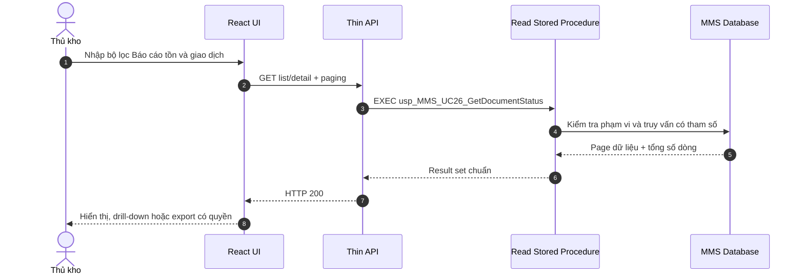
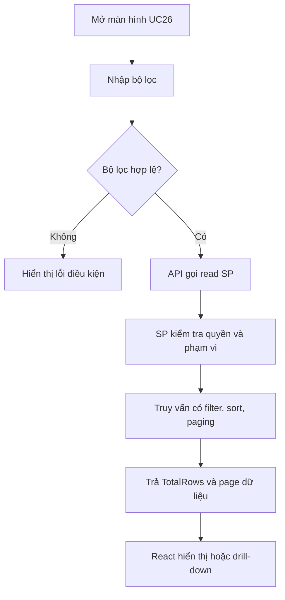
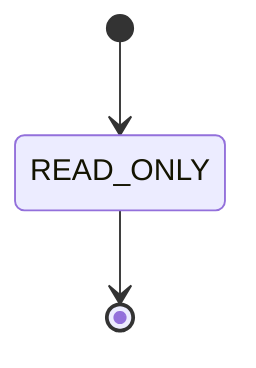

# Phân tích Thiết kế Logic UC26 - Báo cáo tồn và giao dịch

Tài liệu phân tích toàn diện **Business Logic**, **UI/UX Guidelines**, **Programming Logic**, **Data Logic** và **Diagrams** cho chức năng **Báo cáo tồn và giao dịch** khi chuyển hệ thống Quản lý Kho Vật tư từ Power Apps sang React.

Nguyên tắc bắt buộc: React chỉ xử lý giao diện; backend là API host mỏng; mọi quy tắc nghiệp vụ, chuyển trạng thái và transaction nhiều bảng được thực thi trong SQL Stored Procedure.

---

## 1. Business Logic (Logic Nghiệp vụ)

### 1.1. Mục tiêu cốt lõi

Cung cấp báo cáo tồn hiện tại, biến động nhập/xuất và trạng thái chứng từ có đối chiếu tới batch và transaction.

### 1.2. Phạm vi và nguồn hiện hữu

| Màn hình | Nguồn | Datasource phát hiện trong YAML |
|---|---|---|

- Thao tác Power Fx phát hiện: **Không có thao tác UI trực tiếp; thiết kế từ bảng/view và use case**.
- Datasource tham chiếu thực tế: `vw_tong_tonkho, v_ton_he_thong, vw_dm_vattu_tonkho, tbl_batch_inv, tbl_transaction, tbl_phieu_transaction, vw_phieu_dnxk_chitiet`.
- Nhãn giao diện tiêu biểu: Không có màn hình Power Apps trực tiếp.

### 1.3. Actor

- Actor nghiệp vụ: Thủ kho, quản lý, kế toán kho, kiểm toán.
- React Web Client trên PC hoặc mobile/PDA tùy màn hình.
- Backend API xác thực, phân quyền, validate hình thức và gọi SP.
- SQL Server MMS chịu trách nhiệm toàn bộ logic nghiệp vụ.

### 1.4. Tiền điều kiện

- Người dùng đã đăng nhập và có quyền `UC26`.
- Danh mục và chứng từ nguồn liên quan đang hoạt động.
- Dữ liệu đầu vào thuộc đúng kho/bộ phận mà người dùng được phép thao tác.
- Các Stored Procedure của use case đã được triển khai và version tương thích API.

### 1.5. Hậu điều kiện

- Khi thành công, dữ liệu và trạng thái được cập nhật atomic, có người thao tác và thời gian.
- API trả mã kết quả, thông báo và dữ liệu mới nhất do SP xác nhận.
- Khi thất bại, SP rollback toàn bộ phần ghi và không để dữ liệu trung gian dở dang.
- React refresh dữ liệu từ response/read SP; không tự giả lập trạng thái thành công.

### 1.6. Business Rules

- **`[BR-UC26-01]`** Tồn hiện tại tính từ nguồn chuẩn được thống nhất.
- **`[BR-UC26-02]`** Không cộng trùng batch và transaction.
- **`[BR-UC26-03]`** Báo cáo thời điểm dùng mốc thời gian nhất quán.
- **`[BR-UC26-04]`** Số dư đầu + nhập - xuất = số dư cuối.
- **`[BR-UC26-05]`** Phân trang/lọc tại SQL.
- **`[BR-UC26-06]`** Export phải áp dụng cùng quyền như màn hình.

- **`[BR-UC26-07]`** User thao tác lấy từ token; SP kiểm tra lại quyền và phạm vi dữ liệu.
- **`[BR-UC26-08]`** Mọi command phải hỗ trợ `RequestId` để chống gửi lặp.
- **`[BR-UC26-09]`** Không dùng SQL động do client truyền và không cho backend cập nhật bảng trực tiếp.

### 1.7. Luồng chính

| Bước | Thao tác | React/API | SQL Stored Procedure |
|---|---|---|---|
| 1 | Chọn loại báo cáo | Hiển thị/thu thập dữ liệu và gọi API | Đọc, kiểm tra rule hoặc ghi dữ liệu trong SP |
| 2 | Nhập kho/vật tư/batch/khoảng ngày | Hiển thị/thu thập dữ liệu và gọi API | Đọc, kiểm tra rule hoặc ghi dữ liệu trong SP |
| 3 | SP kiểm tra phạm vi quyền | Hiển thị/thu thập dữ liệu và gọi API | Đọc, kiểm tra rule hoặc ghi dữ liệu trong SP |
| 4 | Đọc view hoặc tổng hợp transaction | Hiển thị/thu thập dữ liệu và gọi API | Đọc, kiểm tra rule hoặc ghi dữ liệu trong SP |
| 5 | Hiển thị tổng và chi tiết | Hiển thị/thu thập dữ liệu và gọi API | Đọc, kiểm tra rule hoặc ghi dữ liệu trong SP |
| 6 | Drill-down tới chứng từ | Hiển thị/thu thập dữ liệu và gọi API | Đọc, kiểm tra rule hoặc ghi dữ liệu trong SP |
| 7 | Xuất dữ liệu | Hiển thị/thu thập dữ liệu và gọi API | Đọc, kiểm tra rule hoặc ghi dữ liệu trong SP |

### 1.8. Luồng ngoại lệ

| Mã | Tình huống | HTTP | Xử lý bắt buộc |
|---|---|---:|---|
| `INVALID_INPUT` | Thiếu hoặc sai định dạng dữ liệu | 400 | React đánh dấu trường; SP không ghi dữ liệu |
| `FORBIDDEN` | Không có quyền hoặc sai phạm vi kho | 403 | Không trả dữ liệu ngoài phạm vi |
| `NOT_FOUND` | Chứng từ/danh mục không tồn tại | 404 | Refresh danh sách và yêu cầu chọn lại |
| `INVALID_STATE` | Trạng thái hiện tại không cho phép thao tác | 409 | SP rollback, trả trạng thái mới nhất |
| `CONCURRENCY_CONFLICT` | Dữ liệu đã thay đổi bởi phiên khác | 409 | UI tải lại dữ liệu; không tự retry command |
| `DUPLICATE_REQUEST` | `RequestId` đã xử lý | 200/409 | Trả lại kết quả cũ hoặc mã trùng an toàn |
| `DATABASE_ERROR` | Lỗi SQL ngoài dự kiến | 500 | Rollback và ghi technical log |

### 1.9. State Model

| Trạng thái | Ý nghĩa | Hành động tiếp theo |
|---|---|---|
| READ_ONLY | Trạng thái nghiệp vụ READ_ONLY của báo cáo tồn và giao dịch | Theo state machine và quyền của SP |

---

## 2. UI/UX Guidelines

### 2.1. Cấu trúc màn hình

- Thanh tiêu đề hiển thị tên nghiệp vụ, kho/bộ phận và người đang thao tác.
- Vùng bộ lọc/danh mục ở đầu, vùng dữ liệu chính ở giữa và thanh hành động cố định ở cuối.
- Danh sách nhiều dòng dùng table trên PC và list compact trên mobile, không lồng card.
- Trạng thái hiển thị bằng badge có cả màu và chữ; không chỉ dựa vào màu.
- Command chính chỉ bật khi dữ liệu đầu vào và trạng thái UI hợp lệ.

### 2.2. Trạng thái tương tác

| UI State | Hành vi |
|---|---|
| `idle` | Sẵn sàng nhập/chọn dữ liệu |
| `loading` | Skeleton cho vùng danh sách; giữ ổn định kích thước layout |
| `editing` | Cho phép thay đổi trường theo quyền và trạng thái |
| `submitting` | Khóa submit lặp; hiển thị tiến trình trong nút |
| `success` | Hiển thị mã chứng từ/kết quả và refresh từ server |
| `error` | Giữ dữ liệu người dùng, chỉ rõ trường hoặc rule bị lỗi |
| `conflict` | Cảnh báo dữ liệu đã đổi và cung cấp nút tải lại |

### 2.3. Responsive và accessibility

- Vùng chạm mobile tối thiểu 44 x 44 px; input số mở bàn phím số.
- Table rộng chuyển sang chế độ row detail trên màn hình nhỏ.
- Label liên kết input; lỗi dùng `aria-describedby`; dialog giữ focus đúng chuẩn.
- Hỗ trợ bàn phím cho tìm kiếm, thêm dòng, xác nhận và đóng dialog.
- Không hiển thị hướng dẫn kỹ thuật hoặc tên bảng/SP trong UI sản xuất.

---

## 3. Programming Logic

### 3.1. Ranh giới trách nhiệm

| Lớp | Trách nhiệm | Không được thực hiện |
|---|---|---|
| React | State giao diện, validation định dạng, gọi API, render kết quả | Tính rule nghiệp vụ, đổi trạng thái, ghi SQL |
| Backend | Auth, permission, request schema, correlation id, gọi SP, map HTTP | Viết lại rule hoặc transaction nhiều bảng |
| SQL SP | Validation nghiệp vụ, locking, state transition, CRUD atomic, audit | Trả dữ liệu ngoài phạm vi quyền |

### 3.2. React contract đề xuất

```typescript
export interface B_o_c_o_t_n_v__giao_d_chCommand {
  requestId: string;
  action: string;
  documentId?: number | string;
  warehouseCode?: string;
  payload: Record<string, unknown>;
}

export interface B_o_c_o_t_n_v__giao_d_chResult {
  resultCode: string;
  message: string;
  documentId?: number | string;
  status: string;
  rowVersion?: string;
  data?: Record<string, unknown>;
}
```

Frontend phải gửi đúng kiểu dữ liệu API; số lượng dùng decimal-compatible string khi cần tránh sai số JavaScript.

### 3.3. API endpoints

| Method | Endpoint | Mục đích |
|---|---|---|
| `GET` | `/api/v1/reporting/uc26` | Danh sách có filter và phân trang |
| `GET` | `/api/v1/reporting/uc26/{id}` | Chi tiết chứng từ/đối tượng |
| - | Không có command endpoint | Use case chỉ đọc; export audit dùng endpoint dùng chung |

### 3.4. Backend handler mỏng

```csharp
[HttpGet]
public async Task<IActionResult> Search([FromQuery] SearchB_o_c_o_t_n_v__giao_d_chRequest request)
{
    var result = await _sp.QueryAsync<dynamic>(
        "usp_MMS_UC26_GetDocumentStatus",
        new { request.Keyword, request.FromDate, request.ToDate,
              UserName = _currentUser.UserName });
    return Ok(result);
}
```

Handler không được `INSERT/UPDATE` trực tiếp và không quyết định trạng thái tiếp theo.

---

## 4. SQL Stored Procedure Design

### 4.1. Danh mục SP

| Stored Procedure | Vai trò | Transaction |
|---|---|---|
| usp_MMS_UC26_GetCurrentStock | Read/query | Read-only |
| usp_MMS_UC26_GetStockMovement | Read/query | Read-only |
| usp_MMS_UC26_GetDocumentStatus | Read/query | Read-only |

### 4.2. Read SP contract

**Input chuẩn:** bộ lọc, khoảng thời gian, phân trang và `@UserName` để giới hạn phạm vi. **Output chuẩn:** `TotalRows` và page dữ liệu đã sort ổn định.

### 4.3. Read-only query skeleton

```sql
CREATE OR ALTER PROCEDURE dbo.usp_MMS_UC26_GetDocumentStatus
    @Keyword NVARCHAR(100) = NULL,
    @FromDate DATETIME2(0) = NULL,
    @ToDate DATETIME2(0) = NULL,
    @PageNumber INT = 1,
    @PageSize INT = 50,
    @UserName NVARCHAR(50)
AS
BEGIN
    SET NOCOUNT ON;
    -- 1. Kiểm tra quyền và phạm vi kho của @UserName.
    -- 2. Chuẩn hóa khoảng ngày, PageNumber và PageSize.
    -- 3. Đọc vw_tong_tonkho, v_ton_he_thong, vw_dm_vattu_tonkho, tbl_batch_inv với filter có tham số.
    -- 4. Trả TotalRows và page dữ liệu; không thay đổi nghiệp vụ.
END;
GO
```

Skeleton thể hiện ranh giới kiến trúc, không thay thế đặc tả cột chi tiết của từng SP khi triển khai.

### 4.4. Concurrency và idempotency

- Read SP chạy nhất quán theo mốc thời gian và luôn có sort ổn định trước phân trang.
- Không dùng `NOLOCK` nếu báo cáo cần số liệu đối soát tại cùng một thời điểm.
- Giới hạn `PageSize`, khoảng ngày và thời gian thực thi; export lớn chạy theo job có audit.
- Filter luôn truyền bằng tham số, không nhận biểu thức SQL từ client.

---

## 5. Data Logic

### 5.1. Ma trận CRUD

| Đối tượng | C | R | U | D | Vai trò |
|---|---|---|---|---|---|
| vw_tong_tonkho | - | X | - | - | Nguồn dữ liệu/chứng từ của use case |
| v_ton_he_thong | - | X | - | - | Nguồn dữ liệu/chứng từ của use case |
| vw_dm_vattu_tonkho | - | X | - | - | Nguồn dữ liệu/chứng từ của use case |
| tbl_batch_inv | - | X | - | - | Nguồn dữ liệu/chứng từ của use case |
| tbl_transaction | - | X | - | - | Nguồn dữ liệu/chứng từ của use case |
| tbl_phieu_transaction | - | X | - | - | Nguồn dữ liệu/chứng từ của use case |
| vw_phieu_dnxk_chitiet | - | X | - | - | Nguồn dữ liệu/chứng từ của use case |

### 5.2. Quan hệ dữ liệu trọng tâm

- Aggregate gốc: `vw_tong_tonkho`.
- Dữ liệu liên quan: `v_ton_he_thong, vw_dm_vattu_tonkho, tbl_batch_inv, tbl_transaction, tbl_phieu_transaction, vw_phieu_dnxk_chitiet`.
- View chỉ dùng để đọc; command SP ghi vào bảng nguồn tương ứng.
- Khóa ngoại và khóa nghiệp vụ phải được xác nhận từ DDL SQL Server trước migration production.

### 5.3. Audit fields chuẩn

Mọi bảng command nên có hoặc liên kết được tới `user_cre`, `time_cre`, `user_up`, `time_up`, trạng thái và correlation/request id. Không thực hiện hard delete chứng từ đã phát sinh giao dịch.

---

## 6. Diagrams

### 6.1. Sequence Diagram



### 6.2. Activity Flow



### 6.3. State Diagram



---

## 7. Acceptance Criteria và Test Scenarios

| ID | Kịch bản | Kết quả mong đợi |
|---|---|---|
| AC-UC26-01 | Bộ lọc hợp lệ | Trả đúng page dữ liệu và TotalRows |
| AC-UC26-02 | Khoảng ngày không hợp lệ | INVALID_INPUT; không chạy truy vấn lớn |
| AC-UC26-03 | User không có quyền | HTTP 403; không lộ dữ liệu |
| AC-UC26-04 | Không có kết quả | Danh sách rỗng hợp lệ, không phải lỗi hệ thống |
| AC-UC26-05 | Chuyển trang | Không trùng/thiếu dòng nhờ sort ổn định |
| AC-UC26-06 | Filter kết hợp | Kết quả đúng mọi điều kiện |
| AC-UC26-07 | PageSize vượt giới hạn | SP giới hạn hoặc từ chối |
| AC-UC26-08 | Drill-down chứng từ | Chi tiết khớp dòng tổng hợp |
| AC-UC26-09 | Export | Cùng dữ liệu/quyền với màn hình và có audit |
| AC-UC26-10 | Truy vấn đồng thời | Không khóa ghi kéo dài bất thường |
| AC-UC26-11 | Mobile viewport | Bảng chuyển layout, không tràn UI |
| AC-UC26-12 | SQL timeout | API trả lỗi chuẩn và correlation id |

---

## 8. Traceability

| Thành phần | Nguồn/Đích |
|---|---|
| Use case | `UC26 - Báo cáo tồn và giao dịch` |
| Power Apps screens | `Không có màn hình nguồn trực tiếp` |
| Power Fx operations | `Không có thao tác UI trực tiếp; thiết kế từ bảng/view và use case` |
| Tables/Views | `vw_tong_tonkho,v_ton_he_thong,vw_dm_vattu_tonkho,tbl_batch_inv,tbl_transaction,tbl_phieu_transaction,vw_phieu_dnxk_chitiet` |
| Stored Procedures | `usp_MMS_UC26_GetCurrentStock,usp_MMS_UC26_GetStockMovement,usp_MMS_UC26_GetDocumentStatus` |
| React module | `Reporting` |
| API base | `/api/v1/reporting/uc26` |

## 9. Open Points trước khi lập trình

- Xác nhận DDL thật, khóa chính/ngoại, default và index trên SQL Server MMS.
- Chốt bảng trạng thái và mapping mã số hiện tại sang enum API.
- Chốt quyền chi tiết theo action: VIEW, CREATE, EDIT, APPROVE, CANCEL, PRINT, EXPORT.
- Chốt retention của audit, chứng từ và file đính kèm.
- Viết integration test trực tiếp cho từng SP command trước khi nối React.
