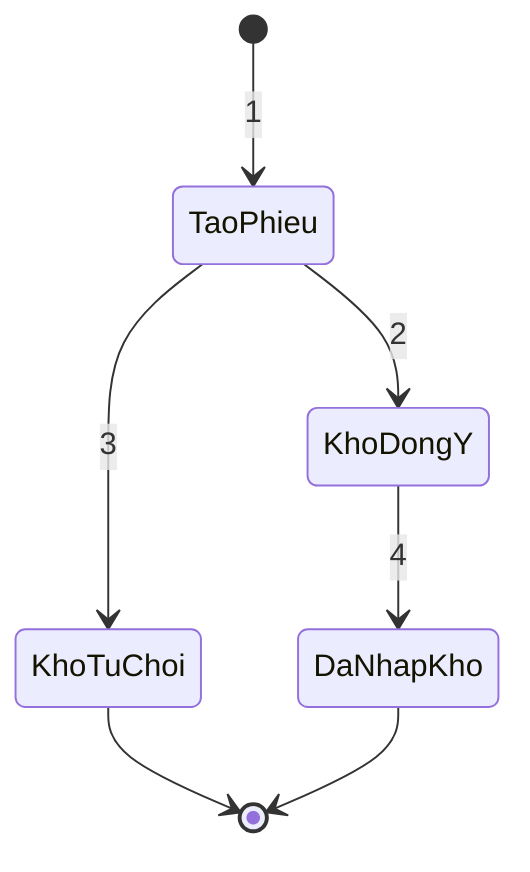
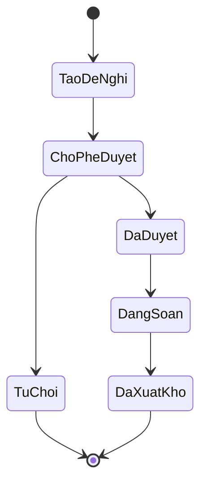

# State Models

## Phiếu trả nội bộ

```mermaid
stateDiagram-v2
  [*] --> TaoPhieu: 1
  TaoPhieu --> KhoDongY: 2
  TaoPhieu --> KhoTuChoi: 3
  KhoDongY --> DaNhapKho: 4
  KhoTuChoi --> [*]
  DaNhapKho --> [*]
```

## Luồng xuất kho

```mermaid
stateDiagram-v2
  [*] --> TaoDeNghi
  TaoDeNghi --> ChoPheDuyet
  ChoPheDuyet --> DaDuyet
  ChoPheDuyet --> TuChoi
  DaDuyet --> DangSoan
  DangSoan --> DaXuatKho
  TuChoi --> [*]
  DaXuatKho --> [*]
```
