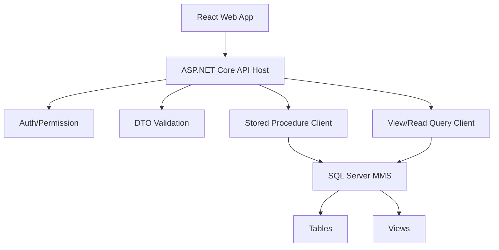

# Component Diagram

```mermaid
flowchart TD
  React["React Web App"] --> Api["ASP.NET Core API Host"]
  Api --> Auth["Auth/Permission"]
  Api --> Validation["DTO Validation"]
  Api --> SpClient["Stored Procedure Client"]
  Api --> Query["View/Read Query Client"]
  SpClient --> Sql["SQL Server MMS"]
  Query --> Sql
  Sql --> Tables["Tables"]
  Sql --> Views["Views"]
```
