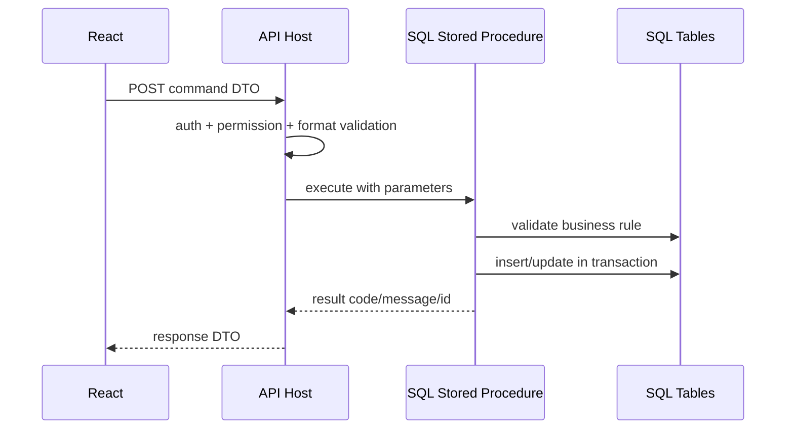

# Sequence Diagrams

## Generic write command

```mermaid
sequenceDiagram
  participant UI as React
  participant API as API Host
  participant SP as SQL Stored Procedure
  participant DB as SQL Tables
  UI->>API: POST command DTO
  API->>API: auth + permission + format validation
  API->>SP: execute with parameters
  SP->>DB: validate business rule
  SP->>DB: insert/update in transaction
  SP-->>API: result code/message/id
  API-->>UI: response DTO
```
